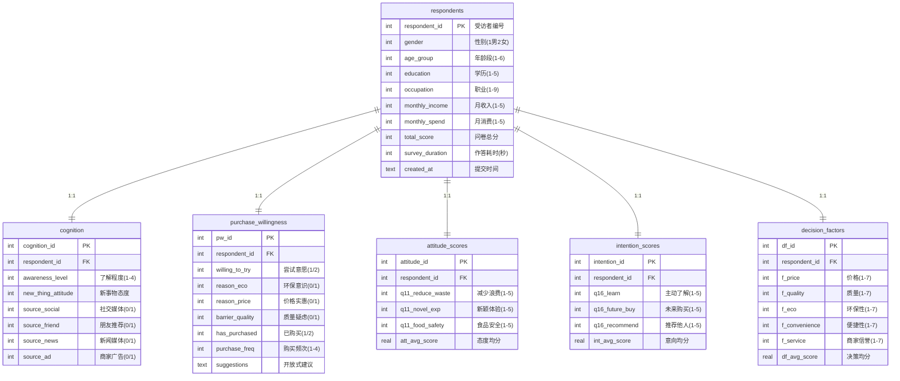

# SQL 能力作品集

## 项目概述

**项目名称**：西安居民剩菜盲盒认知与购买意愿调查 — 数据分析系统

**数据来源**：624份有效问卷，「惜食减损，"剩"者为王」正大杯调研项目

**技术栈**：SQLite 3 / Python (openpyxl, sqlite3) / Chart.js / HTML5

---

## 作品集结构

```
portfolio/
├── 01_schema_design.sql        # 数据库DDL：6表+3视图+索引+约束
├── 02_query_portfolio.sql      # SQL查询组合：32条查询（L1-L5）
├── 03_etl_pipeline.py          # ETL管道：Excel → SQLite（数据清洗+导入）
├── 西安剩菜盲盒市场分析看板.html  # 交互式数据看板（5个Tab）
├── 05_portfolio_report.md      # 本文件：作品集总说明
├── export_dashboard_data.py    # 看板数据导出辅助脚本
└── data/
    ├── survey.db               # SQLite数据库（624条×6表）
    └── dashboard_data.json     # 看板预计算数据
```

---

## 数据库设计

### ER图



### 设计要点

| 特性 | 实现 |
|------|------|
| 数据规范化 | 2NF/3NF，消除冗余，6表拆分 |
| 参照完整性 | 所有子表通过 `respondent_id` 外键关联 |
| CHECK约束 | 性别1-2、年龄1-6、Likert量表范围等 |
| 索引优化 | 性别/年龄/学历/收入/了解程度/购买意愿等查询热点 |
| 计算字段 | `att_avg_score`、`int_avg_score`、`df_avg_score` 自动均值 |
| 视图 | `v_respondent_full`(全画像)、`v_conversion_funnel`(转化漏斗)、`v_high_intention_users`(高意向用户) |

---

## SQL 查询难度矩阵

| 等级 | 编号 | 主题 | 核心技术 |
|:---:|------|------|----------|
| **L1** | Q1-Q5 | 基础查询 | SELECT, WHERE, LIKE, IN, BETWEEN, DISTINCT, ORDER BY, LIMIT, CASE WHEN |
| **L2** | Q6-Q10 | 聚合分析 | GROUP BY, HAVING, COUNT/SUM/AVG, CASE WHEN 分段, UNION ALL |
| **L3** | Q11-Q14 | 连接查询 | INNER JOIN(5表), LEFT JOIN, 自连接, UNION 行转列, RANK |
| **L4** | Q15-Q24 | 高级查询 | ROW_NUMBER, RANK/DENSE_RANK, LAG/LEAD, CTE(WITH), 相关子查询, EXISTS/NOT EXISTS, 窗口聚合, NTILE, PERCENT_RANK, CUME_DIST |
| **L5** | Q25-Q32 | 业务分析 | 转化漏斗, RFM分段, 群体画像, 对比分析, 交叉分析, FIRST_VALUE |

### SQL 能力覆盖清单

- [x] **基础检索**：SELECT / WHERE / LIKE / IN / BETWEEN / DISTINCT
- [x] **排序分页**：ORDER BY / LIMIT / OFFSET
- [x] **聚合函数**：COUNT / SUM / AVG / MAX / MIN / ROUND
- [x] **分组过滤**：GROUP BY / HAVING / CASE WHEN
- [x] **表连接**：INNER JOIN / LEFT JOIN / 自连接 / 多表(5+)联查
- [x] **子查询**：标量子查询 / 行子查询 / 表子查询 / 相关子查询
- [x] **集合操作**：UNION / UNION ALL
- [x] **窗口函数**：ROW_NUMBER / RANK / DENSE_RANK / NTILE / LAG / LEAD / FIRST_VALUE / PERCENT_RANK / CUME_DIST
- [x] **CTE**：WITH 单层 / WITH 嵌套 / CTE + JOIN
- [x] **条件逻辑**：CASE WHEN / COALESCE / NULLIF
- [x] **存在性检查**：EXISTS / NOT EXISTS / IN / NOT IN
- [x] **数据完整性**：PRIMARY KEY / FOREIGN KEY / CHECK / NOT NULL / UNIQUE
- [x] **性能优化**：复合索引 / 覆盖索引 / 查询计划
- [x] **业务分析**：转化漏斗 / RFM分段 / 群体画像 / 队列分析

---

## 数据看板功能

| Tab | 内容 | 图表类型 |
|-----|------|----------|
| 1. 受访者画像 | 性别/年龄/学历/收入分布 | 环形图 ×4 |
| 2. 认知与意愿 | 了解程度、转化漏斗、学历对比、意向维度 | 环形图+漏斗图+分组柱状图+横向柱状图 |
| 3. 决策因素 | 购买动机、障碍、9因子雷达图 | 横向柱状图 ×2 + 雷达图 |
| 4. 用户细分 | RFM分段、群体画像表、8大核心发现 | 环形图+表格+洞察卡片 |
| 5. SQL展示 | 6条代表性查询(可折叠代码) | 语法高亮代码块 |

---

## 关键数据发现

### 核心指标
- 样本总量：**624**人
- 女性占比：**65.5%**，本科及以上：**66.5%**
- 愿意尝试购买：**80.6%** (503人)
- 曾经购买过：**55.3%** (345人)
- 态度均分：**4.07/5**，意向均分：**3.82/5**

### 转化漏斗
```
总受访者 (624人, 100%)
  → 了解程度≥一般 (353人, 56.6%)
    → 愿意尝试 (503人, 80.6%)
      → 曾经购买 (345人, 55.3%)
```

### 决策因素影响力排名 (1-7量表)
| 排名 | 因素 | 均分 |
|:---:|------|:---:|
| 1 | **质量** | 6.00 |
| 2 | 商家信誉与服务 | 5.82 |
| 3 | 食物种类与口味 | 5.78 |
| 4 | 购买便捷性 | 5.67 |
| 5 | 价格 | 5.53 |

### 用户分段
| 群体 | 人数 | 占比 | 特征 |
|------|:---:|:---:|------|
| 核心用户 | 8 | 1.3% | 高频+高意向+高满意 |
| 活跃用户 | 245 | 39.3% | 已购买+高意向 |
| 潜力用户 | 219 | 35.1% | 愿意但未购买 |
| 观望用户 | 53 | 8.5% | 愿意但意向低 |
| 流失用户 | 99 | 15.9% | 不愿意购买 |

---

## 使用说明

### 环境要求
- Python 3.8+
- 依赖：`openpyxl` (已内置sqlite3)

### 运行步骤

```bash
# 1. 初始化数据库 + 导入数据
python 03_etl_pipeline.py

# 2. 导出看板数据
python export_dashboard_data.py

# 3. 在浏览器打开看板
# 直接双击 西安剩菜盲盒市场分析看板.html

# 4. 运行SQL查询（在SQLite命令行）
sqlite3 data/survey.db < 02_query_portfolio.sql
```

---

## 作品集亮点

1. **完整数据管道**：从原始Excel → ETL清洗 → 规范化入库 → SQL分析 → 可视化看板
2. **规范化设计**：6表3NF设计，外键约束，CHECK约束，复合索引
3. **SQL广度**：32条查询覆盖从基础SELECT到RFM商业分析的完整技能链
4. **专业看板**：单文件HTML交互式仪表盘，5个分析模块，即时可用
5. **真实数据**：基于624份真实调研问卷，非模拟数据

---

*西北大学 · 正大杯项目组 · 2024*
